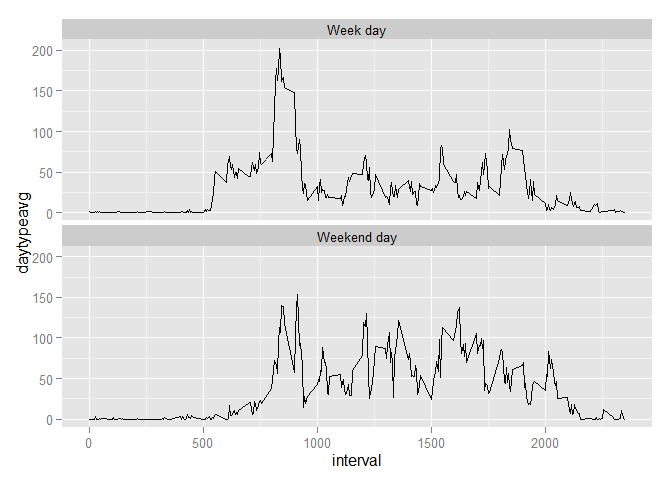

# Reproducible Research: Peer Assessment 1


## Loading and preprocessing the data
First, we will load the required libraries.  Second we must read and summarize the code, in order to draw the histogram of steps taken each day.

```r
library(stringr)
library(dplyr)
```

```
## 
## Attaching package: 'dplyr'
## 
## The following objects are masked from 'package:stats':
## 
##     filter, lag
## 
## The following objects are masked from 'package:base':
## 
##     intersect, setdiff, setequal, union
```

```r
library(ggplot2)
```


```r
raw <- read.csv("C:/Users/Pierre/Documents/Github/RepData_PeerAssessment1/activity/activity.csv")
by_date <- group_by(raw, date)
steps_by_day <- summarize(by_date, total_steps = sum(steps))
ggplot(steps_by_day, aes(total_steps)) + geom_histogram()
```

 


## What is mean total number of steps taken per day?

```r
mean(steps_by_day$total_steps, na.rm = TRUE)
```

```
## [1] 10766.19
```

```r
median(steps_by_day$total_steps, na.rm = TRUE)
```

```
## [1] 10765
```


## What is the average daily activity pattern?

```r
by_interval <- group_by(raw,interval)
avg_steps_per_interval <- summarize(by_interval, steps = mean(steps, na.rm = TRUE))
ggplot(avg_steps_per_interval, aes(interval, steps)) + geom_line()
```

 

```r
max_interval_avg <- avg_steps_per_interval[avg_steps_per_interval$steps == max(avg_steps_per_interval$steps),]
```
The interval containing the maximum, on average, activity is 835, which has a value of 206.1698113.

## Imputing missing values

```r
rows_with_nas <- sum(!complete.cases(raw))
missing_steps <- sum(is.na(raw$steps))
```
There are 2304 NAs in the data and 100% of them occur in the steps column.   My strategy to replace missing values is to write a zero in for every missing value.


```r
noNAs <- raw
missing_cases <- which(is.na(noNAs$steps))
noNAs[missing_cases,"steps"] <- 0
nby_date <- group_by(noNAs,date)
nsteps_by_day <- summarize(nby_date,total_steps = sum(steps))
mean(nsteps_by_day$total_steps)
```

```
## [1] 9354.23
```

```r
median(nsteps_by_day$total_steps)
```

```
## [1] 10395
```

The impact of imputing zeros into the data set cause both the mean and the median to decline in value.   Also, the mean became lower than the median, indicating the the data is left skewed.

## Are there differences in activity patterns between weekdays and weekends?


```r
noNAs <- mutate(noNAs, day_of_week = weekdays(as.Date(date)))
noNAs[noNAs$day_of_week == "Sunday","day_of_week"] <- "Weekend day"
noNAs[noNAs$day_of_week == "Saturday","day_of_week"] <- "Weekend day"
noNAs[noNAs$day_of_week != "Weekend day","day_of_week"] <- "Week day"
nby_intervalday = group_by(noNAs,interval,day_of_week)
navg_interval_by_day_of_week <- summarize(nby_intervalday,daytypeavg = mean(steps))
ggplot(navg_interval_by_day_of_week,aes(interval,daytypeavg)) + geom_line() + facet_wrap(~ day_of_week, nrow = 2)
```

 

Weekend activity starts slower in the morning, although both week days and weekend days have a burst of activity between 8 and 9 am, although the weekend burst is lower than the weekday burst.   During the bulk of the day, activity is erratic for both types of day, although the mean of the weekend activity appears to be higher than the week day activity.
