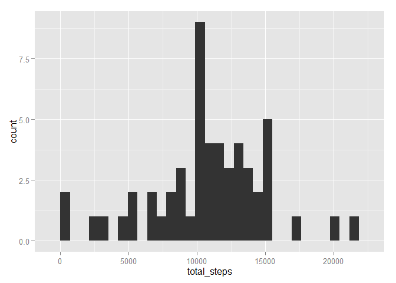
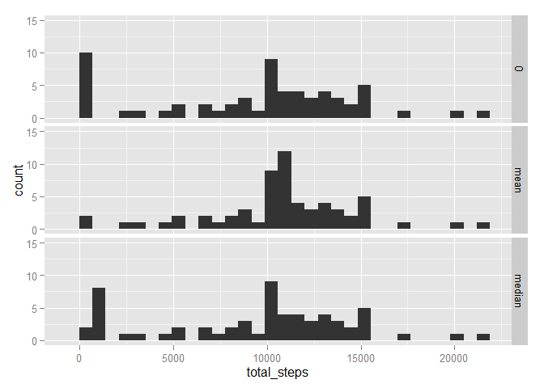
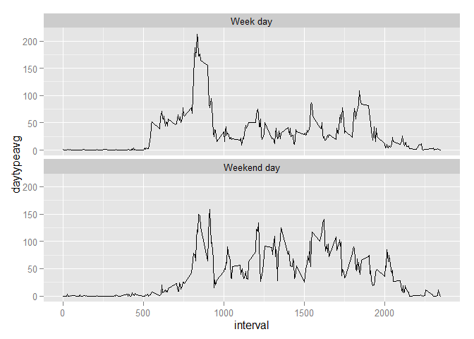

# Reproducible Research: Peer Assessment 1


## Loading and preprocessing the data
First, we will load the required libraries.  Second we must read and summarize the code, in order to draw the histogram of steps taken each day.

```r
library(stringr)
library(dplyr)
```

```
## 
## Attaching package: 'dplyr'
## 
## The following objects are masked from 'package:stats':
## 
##     filter, lag
## 
## The following objects are masked from 'package:base':
## 
##     intersect, setdiff, setequal, union
```

```r
library(ggplot2)
```


```r
raw <- read.csv("C:/Users/Pierre/Documents/Github/RepData_PeerAssessment1/activity/activity.csv")
by_date <- group_by(raw, date)
steps_by_day <- summarize(by_date, total_steps = sum(steps))
ggplot(steps_by_day, aes(total_steps)) + geom_histogram()
```

 


## What is mean total number of steps taken per day?

```r
mean(steps_by_day$total_steps, na.rm = TRUE)
```

```
## [1] 10766.19
```

```r
median(steps_by_day$total_steps, na.rm = TRUE)
```

```
## [1] 10765
```


## What is the average daily activity pattern?

```r
by_interval <- group_by(raw,interval)
avg_steps_per_interval <- summarize(by_interval, steps = mean(steps, na.rm = TRUE))
ggplot(avg_steps_per_interval, aes(interval, steps)) + geom_line()
```

 

```r
max_interval_avg <- avg_steps_per_interval[avg_steps_per_interval$steps == max(avg_steps_per_interval$steps),]
max_interval_avg
```

```
## Source: local data frame [1 x 2]
## 
##   interval    steps
## 1      835 206.1698
```
The interval containing the maximum, on average, activity is 835, which has a value of 206.1698113.

## Imputing missing values

```r
rows_with_nas <- sum(!complete.cases(raw))
rows_with_nas
```

```
## [1] 2304
```

```r
missing_steps <- sum(is.na(raw$steps))
missing_steps
```

```
## [1] 2304
```
There are 2304 NAs in the data and 100% of them occur in the steps column.   In order to achieve the best imputation, I will trial three different approaches.   The first approach will impute 0s for all NAs.   The second approach will impute the interval mean.   The third approach will impute the interval median.   I will compare results from the three approaches to see which is best.


```r
#first approach - just write a 0
noNAs <- raw
missing_cases <- which(is.na(noNAs$steps))
noNAs[missing_cases,"steps"] <- 0
noNAs_0 <- noNAs
noNAs_0$method <- 1

#second approach - use the mean for that interval
noNAs <- raw
missing_cases <- which(is.na(noNAs$steps))
x <- NULL
for (i in 1:length(missing_cases)){y <- mean(raw[raw$interval == raw[missing_cases[i],"interval"], "steps"], na.rm = TRUE); x <- c(x,y)}
missing_cases <- data.frame(cbind(missing_cases,x))
names(missing_cases) <- c("row","steps")
noNAs[missing_cases$row,"steps"] <- missing_cases$steps
noNAs_mean <- noNAs
noNAs_mean$method <- 2

#third approach - use the median for that interval
noNAs <- raw
missing_cases <- which(is.na(noNAs$steps))
x <- NULL
for (i in 1:length(missing_cases)){y <- median(raw[raw$interval == raw[missing_cases[i],"interval"], "steps"], na.rm = TRUE); x <- c(x,y)}
missing_cases <- data.frame(cbind(missing_cases,x))
names(missing_cases) <- c("row","steps")
noNAs[missing_cases$row,"steps"] <- missing_cases$steps
noNAs_median <- noNAs
noNAs_median$method <- 3

noNAs <-rbind(noNAs_0, noNAs_mean, noNAs_median)
noNAs$method <- as.factor(noNAs$method)
levels(noNAs$method) <- c("0", "mean", "median")

nby_date <- group_by(noNAs,date, method)
nsteps_by_day <- summarize(nby_date,total_steps = sum(steps))
ggplot(nsteps_by_day, aes(total_steps)) + geom_histogram() + ylim(0,15) + facet_grid(method~.)
```

 

```r
m1 <- mean(nsteps_by_day[nsteps_by_day$method == "0",]$total_steps)
m2 <- mean(nsteps_by_day[nsteps_by_day$method == "mean",]$total_steps)
m3 <- mean(nsteps_by_day[nsteps_by_day$method == "median",]$total_steps)
n1 <- median(nsteps_by_day[nsteps_by_day$method == "0",]$total_steps)
n2 <- median(nsteps_by_day[nsteps_by_day$method == "mean",]$total_steps)
n3 <- median(nsteps_by_day[nsteps_by_day$method == "median",]$total_steps)
data.frame(zero = c(m1, n1), mean = c(m2, n2), median = c(m3, n3), row.names = c("mean", "median"))
```

```
##            zero     mean    median
## mean    9354.23 10766.19  9503.869
## median 10395.00 10766.19 10395.000
```

The effect of using the three different approaches is to cause the NAs to have different imputed values.   The approach using zero gives the lowest steps per day, then approach using median gives the second lowest steps per day and the approach using mean gives the highest steps per day.   Based on this, I suspect that using the median to impute values may yield the best results.

## Are there differences in activity patterns between weekdays and weekends?


```r
noNAs <- mutate(noNAs, day_of_week = weekdays(as.Date(date)))
noNAs[noNAs$day_of_week == "Sunday","day_of_week"] <- "Weekend day"
noNAs[noNAs$day_of_week == "Saturday","day_of_week"] <- "Weekend day"
noNAs[noNAs$day_of_week != "Weekend day","day_of_week"] <- "Week day"
nby_intervalday = group_by(noNAs,interval,day_of_week)
navg_interval_by_day_of_week <- summarize(nby_intervalday,daytypeavg = mean(steps))
ggplot(navg_interval_by_day_of_week,aes(interval,daytypeavg)) + geom_line() + facet_wrap(~ day_of_week, nrow = 2)
```

 

Weekend activity starts slower in the morning, although both week days and weekend days have a burst of activity between 8 and 9 am, although the weekend burst is lower than the weekday burst.   During the bulk of the day, activity is erratic for both types of day, although the mean of the weekend activity appears to be higher than the week day activity.
